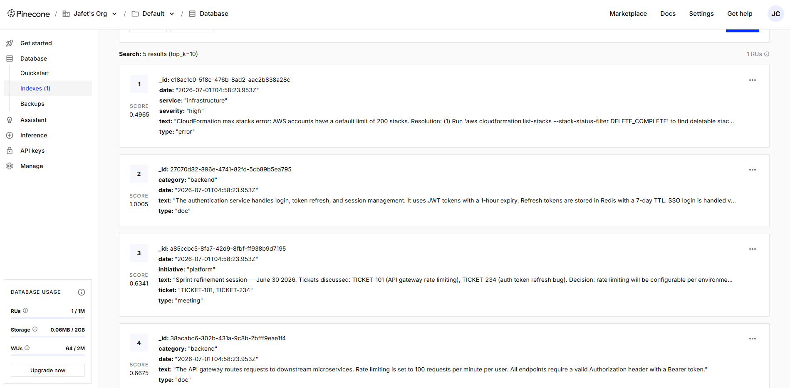
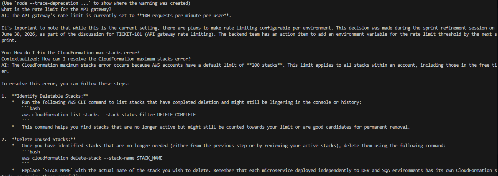

# Engineering Knowledge Hub

LLM-powered knowledge system for software development teams. Centralizes meeting transcripts, documentation Q&A, error tracking, and deployment visibility in a single conversational interface.

---

## Prerequisites

- Node.js 18+
- Google AI Studio API key — [aistudio.google.com](https://aistudio.google.com)
- Pinecone account — [pinecone.io](https://pinecone.io)

---

## Setup

### 1. Install dependencies

```bash
npm install --registry https://registry.npmjs.org
```

### 2. Configure environment

Copy `.env.example` to `.env` and fill in the values:

```bash
GOOGLE_API_KEY=your-google-api-key
PINECONE_API_KEY=your-pinecone-api-key
PINECONE_INDEX=knowledge-hub
PINECONE_HOST=https://your-index-host.pinecone.io
```

### 3. Create Pinecone index

In [pinecone.io](https://pinecone.io), create a new index with:

- **Dimensions:** 3072
- **Metric:** cosine
- **Provider:** Pinecone hosted (serverless)

Copy the index host URL into `PINECONE_HOST` in your `.env`.

### 4. Load sample data

```bash
npm run seed
```

This loads 5 sample documents into the vector store so Q&A works immediately.

---

## Usage

### Start the router (recommended)

```bash
npm start
```

The router classifies your input and delegates to the right module automatically.

```
╔══════════════════════════════════════╗
║   Engineering Knowledge Hub           ║
╚══════════════════════════════════════╝

You: How do I fix the CloudFormation max stacks error?
Routing to: ERROR_QUERY

AI: The CloudFormation maximum stacks error occurs because AWS accounts have a
default limit of 200 stacks...
```

### Run modules individually

| Command | Description |
|---------|-------------|
| `npm run ingest` | Paste a meeting transcript to extract and store structured data |
| `npm run qa` | Ask questions against the knowledge base |
| `npm run errors` | Save or query development errors |
| `npm run deployment` | Check which branch is deployed in DEV or SQA |

---

## How it works

### Architecture

The system routes user input through four modules, each backed by the same Pinecone vector store:

```
User Input
    │
    ▼
Router Agent (Gemini 2.5 Flash)
    ├── INGEST     → Meeting Ingestion Chain
    ├── QUERY      → Documentation Q&A (RAG)
    ├── ERROR_*    → Error Knowledge Base
    └── DEPLOYMENT → Deployment Agent (Tool Calling)
                           │
                    Pinecone Vector Store
                    gemini-embedding-001 · 3072 dims
```

### Module 1 — Meeting Ingestion

Paste a raw Zoom or meeting transcript. The LLM extracts tickets, decisions, acceptance criteria, and action items, then stores them as structured embeddings.

### Module 2 — Documentation Q&A

Semantic search over all stored documents with conversation history. Follow-up questions are automatically rewritten to be self-contained.

### Module 3 — Error Knowledge Base

Two operations:
- **save** — Structures and stores an error + solution
- **query** — Retrieves relevant errors by semantic similarity

### Module 4 — Deployment Agent

Uses tool calling to check `data/deployment-state.json` for branch and environment state, then optionally notifies a Slack channel.

---

## Vector store — Pinecone

Documents stored in Pinecone carry metadata for filtered retrieval:

| Field | Values |
|-------|--------|
| `type` | `doc` · `meeting` · `error` |
| `category` | `backend` · `infrastructure` · `frontend` |
| `service` | service name |
| `severity` | `low` · `medium` · `high` · `critical` |
| `ticket` | ticket ID (e.g. TICKET-101) |
| `date` | ISO 8601 timestamp |

After running `npm run seed`, the index looks like this:



---

## Q&A in action

The system retrieves the most relevant documents and generates a detailed, grounded response:



---

## Models

| Component | Model | Reason |
|-----------|-------|--------|
| Router | `gemini-2.5-flash` | Runs on every query — cost-critical |
| Ingestion | `gemini-2.5-flash` | Structured extraction |
| Q&A Generation | `gemini-2.5-flash` | User-facing answers |
| Error KB | `gemini-2.5-flash` | Retrieval + response |
| Deployment Agent | `gemini-2.5-flash` | Tool calling |
| Embeddings | `gemini-embedding-001` | 3072-dim semantic vectors |

To activate per-task model assignment (Flash for extraction, Pro for Q&A generation), see the `// PAID TIER` comments in `src/config/models.ts`.

---

## Project structure

```
src/
├── config/
│   └── models.ts          # LLM and embedding configuration
├── shared/
│   └── vectorStore.ts     # Pinecone connection
├── modules/
│   ├── ingestion/         # Module 1 — Meeting ingestion
│   ├── qa/                # Module 2 — Documentation Q&A
│   ├── errors/            # Module 3 — Error knowledge base
│   └── deployment/        # Module 4 — Deployment agent
├── utils/
│   └── chat.ts            # Terminal chat interface
├── index.ts               # Router
└── seed.ts                # Sample data loader
data/
└── deployment-state.json  # Mock deployment state (DEV / SQA)
```
